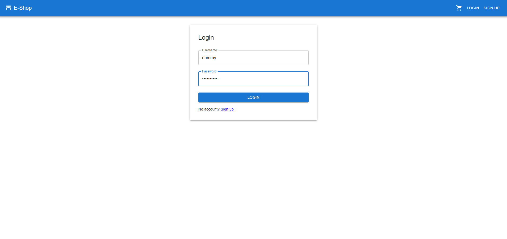
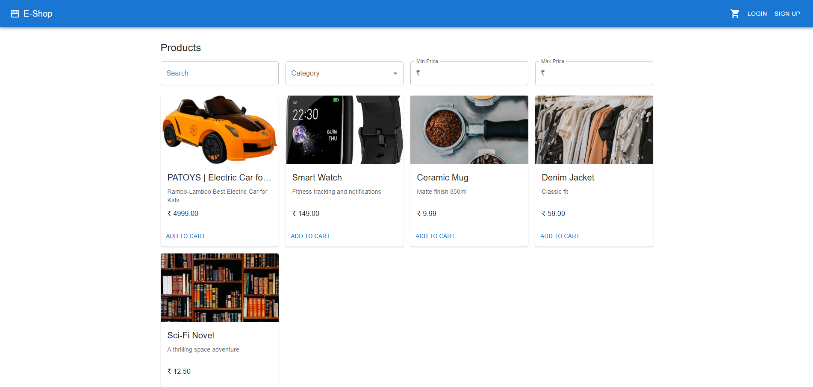
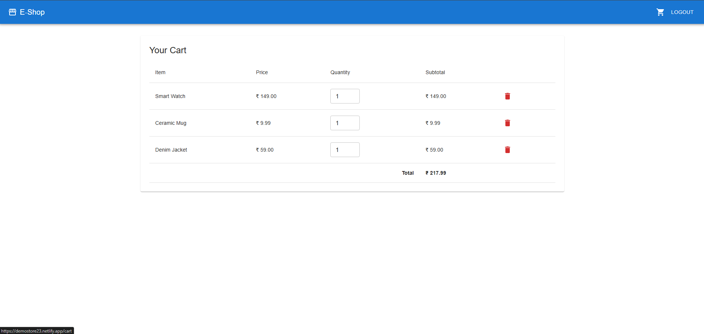

# 🛍️ E-Commerce Web Application

A full-stack single-page **E-Commerce Web Application** built with **React.js** (frontend) and **Django REST Framework (DRF)** (backend).  
The application implements authentication, product listing with filters, and a persistent cart system.  

---

## 🚀 Live Demo

🔗 **Frontend (React):** [frontend-demo-link](https://demostore23.netlify.app/)  
🔗 **Backend (DRF API):** [backend-demo-link](https://ecommerce-backend-5wbp.onrender.com)  

### Demo Credentials
- **Username:** `demo`  
- **Password:** `demo1234`

---

## 📌 Features

### 🔐 Authentication
- Signup, Login, and Logout using **JWT tokens**.
- Tokens stored securely for session management.

### 🛒 Products
- **CRUD APIs** for items (only accessible to authenticated users).
- Product listing with filters:
  - By **category**
  - By **price range**
  - By **search keyword**

### 🛍️ Cart
- Add and remove items to/from cart.
- Cart persists even after logging out and logging back in.

### 🎨 Frontend
- Modern, responsive UI using **Material-UI (MUI)**.
- Pages included:
  - Signup & Login
  - Product Listing with Filters
  - Cart Page

---

## 🛠️ Tech Stack

### Backend
- **Django** & **Django REST Framework (DRF)**
- **PostgreSQL / SQLite** (for development)
- **Simple JWT** for authentication
- Seed script for categories & products

### Frontend
- **React.js** (CRA or Vite)
- **Material-UI (MUI)** for design
- **Axios** for API calls
- **React Router** for SPA navigation

---

## ⚙️ Installation & Setup

### 1. Clone Repositories
```bash
# Clone backend
git clone https://github.com/anurag8773/Ecommerce-Backend.git
cd ecommerce-backend

# Clone frontend
git clone https://github.com/anurag8773/Ecommerce-Frontend.git
cd ecommerce-frontend
````

---

### 2. Backend Setup (Django + DRF)

```bash
cd ecommerce-backend
python -m venv venv
source venv/bin/activate   # On Windows use venv\Scripts\activate
pip install -r requirements.txt

# Run migrations
python manage.py migrate

# Seed sample data (categories & products)
python seed.py

# Start server
python manage.py runserver
```

Backend runs at: `http://127.0.0.1:8000/`

---

### 3. Frontend Setup (React)

```bash
cd ecommerce-frontend
npm install
npm start
```

Frontend runs at: `http://localhost:3000/`

---

## 📂 Project Structure

### Backend (`ecommerce-backend`)

```
shop/
 ├── models.py       # Item, Category, Cart models
 ├── views.py        # CRUD + Auth views
 ├── serializers.py  # DRF serializers
 ├── urls.py         # API routes
seed.py              # Seed script for sample data
```

### Frontend (`ecommerce-frontend`)

```
src/
 ├── components/
 │   ├── Filters.jsx       # Product filters
 │   ├── ProductList.jsx   # List of products
 │   ├── Cart.jsx          # Cart page
 │   ├── Auth/             # Signup & Login forms
 ├── services/
 │   └── api.js            # Axios setup
 ├── App.js                # Routes
```

---

## 📸 Screenshots

### 🔑 Authentication



### 🛒 Product Listing



### 🛍️ Cart



---

## 📖 API Endpoints

### Auth

* `POST /api/auth/signup/` → Register new user
* `POST /api/auth/login/` → Login (JWT)

### Products

* `GET /api/items/` → List all items (with filters)
* `POST /api/items/` → Create item (admin only)
* `PUT /api/items/:id/` → Update item
* `DELETE /api/items/:id/` → Delete item

### Cart

* `GET /api/cart/` → Get cart items
* `POST /api/cart/add/` → Add item to cart
* `POST /api/cart/remove/` → Remove item from cart

---

## 👨‍💻 Author

Developed by **[Anurag Kumar Maurya](https://github.com/anurag8773)**
📧 Contact: [Email](mailto:singhanurag8773@gmail.com)
